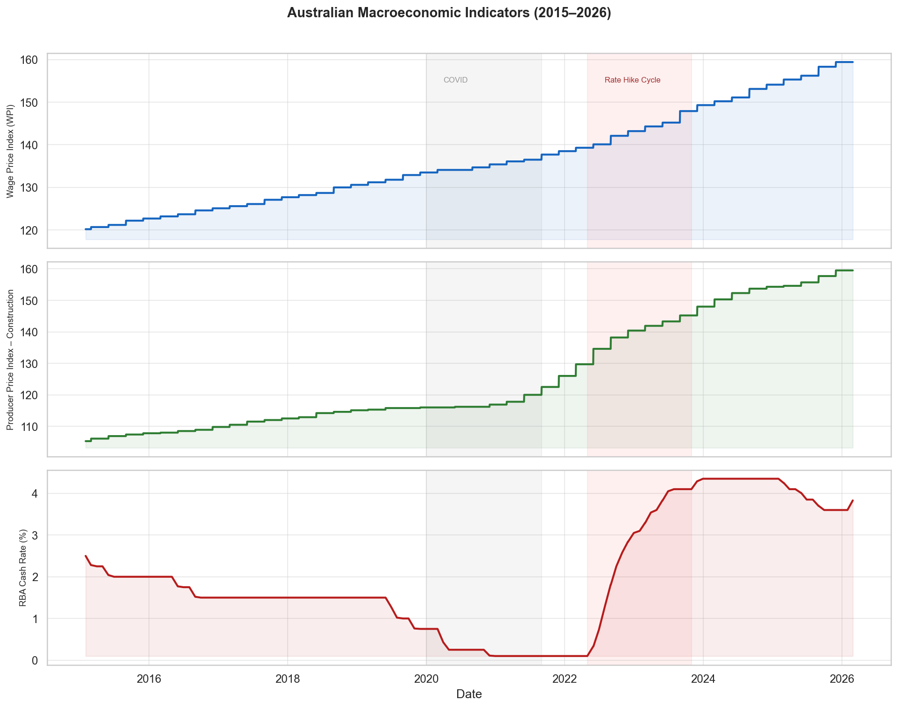
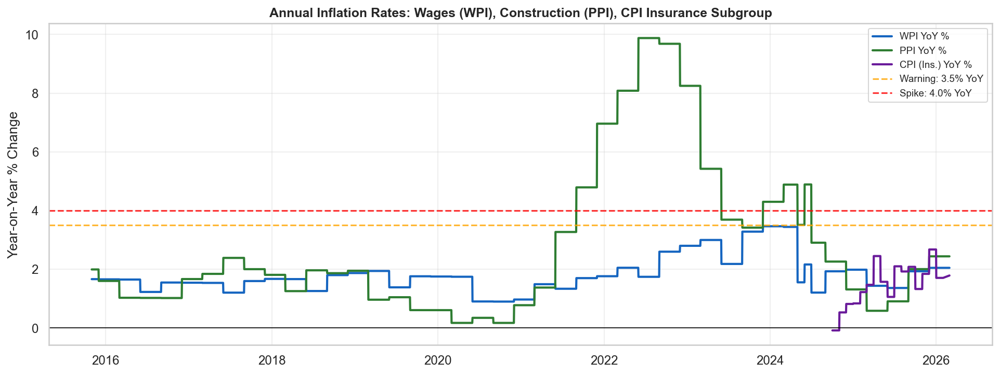
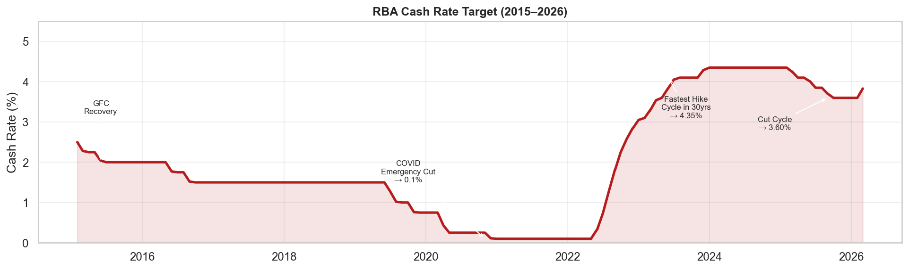
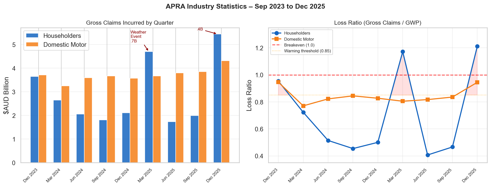
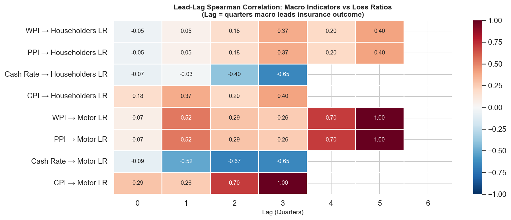
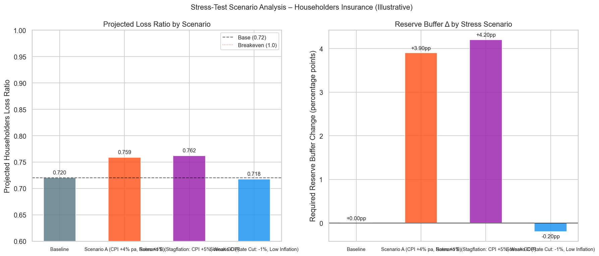

# Macroeconomic Impact on General Insurance Claims
### An End-to-End Data Analytics Portfolio Project

**Author:** Aayush Yagol
**Tools:** Python · Pandas · Scikit-learn · Statsmodels · Plotly · Streamlit · Jupyter
**Data:** ABS (CPI / WPI / PPI) · RBA F1.1 · APRA GI Statistics Dec 2025

---

## Table of Contents
1. [Project Background & Objective](#1-project-background--objective)
2. [The Business Question](#2-the-business-question)
3. [Data Sources & Architecture](#3-data-sources--architecture)
4. [Methodology: Step-by-Step](#4-methodology-step-by-step)
5. [Key Findings & Insights](#5-key-findings--insights)
6. [Visualisations](#6-visualisations)
7. [Stress-Test Scenarios](#7-stress-test-scenarios)
8. [Obstacles & How I Solved Them](#8-obstacles--how-i-solved-them)
9. [Limitations & Caveats](#9-limitations--caveats)
10. [How to Run the Project](#10-how-to-run-the-project)
11. [Project Structure](#11-project-structure)

---

## 1. Project Background & Objective

Australia's general insurance industry faces growing pressure from **inflation**. Rebuilding a flood-damaged home, repairing a hail-dented car, or replacing stolen equipment all cost more when wages rise, construction materials inflate, and supply chains tighten. Yet pricing and reserving cycles in insurance typically operate on a 12–18 month lag relative to macro conditions.

This project asks a simple but commercially valuable question:

> **Can macro-economic indicators — wage growth, construction costs, CPI, and interest rates — predict insurance claim costs before the insurer's loss account catches up?**

The target audience was framed as three internal stakeholders:
- **Head of Claims** — early warning signals for claim severity
- **CFO** — capital sufficiency and stress-test inputs
- **Underwriting Strategy** — loss ratio risk in pricing cycles

---

## 2. The Business Question

**Primary signal tested:**
12-month lagged correlation between macro indicators and claim severity (gross claims incurred).

**Hypothesis:**
When wages and construction costs rise today, repair/rebuild costs on insurance claims will follow in 2–4 quarters — because repair quotes are embedded in current labour and materials prices, but claims are lodged, assessed, and paid over a pipeline that stretches 6–18 months.

**Evaluation metrics:**
- Spearman rank correlation (handles non-normal distributions and small N)
- MAE / RMSE for regression models
- Loss Ratio as primary insurance target (`gross claims / GWP`)

---

## 3. Data Sources & Architecture

| Source | Series | Cadence | Coverage |
|--------|--------|---------|---------|
| ABS 6401.0 | CPI — Insurance & Financial Services subgroup (`A130393720C`) | Monthly | Apr 2024 – Feb 2026 |
| ABS 6345.0 | Wage Price Index — Total hourly excl. bonuses (`A2603609J`) | Quarterly | Sep 1997 – Dec 2025 |
| ABS 6427.0 | PPI — Construction output (`A2333649T`) | Quarterly | Full history |
| RBA F1.1 | Cash Rate Target (`FIRMMCRT`) | Monthly | Jun 1969 – present |
| APRA GI Stats | Gross Claims / GWP / Loss Ratio — Householders & Domestic Motor | Quarterly | **Sep 2023 – Dec 2025 (9 quarters)** |

**Critical data constraint:** The APRA Dec 2025 quarterly publication covers only 9 quarters. This is the binding constraint on all statistical models. The macro history (WPI/PPI/RBA) extends back to 1997 but without historical APRA class-level breakdowns, the overlap window for correlation testing is limited to 2023–2025.

### Pipeline Architecture

```
data/raw/              ← Raw Excel files from ABS, RBA, APRA
     ↓
data_engineering.py    ← Clean, deduplicate, compute derived features
     ↓
data/processed/
  economic_master.csv  ← 193 rows | monthly | 2015–2026
  insurance_master.csv ← 9 rows  | quarterly | 2023–2025
  model_ready.csv      ← 9 rows  | merged + 64 lag/feature columns
     ↓
modeling/train_models.py     ← OLS / Ridge / Lasso + stress tests
notebooks/Econ_Insurance_Correlation.ipynb  ← Full EDA
dashboard/app.py             ← Streamlit interactive dashboard
```

---

## 4. Methodology: Step-by-Step

### Step 1 — Data Ingestion & Cleaning
ABS Excel files use a non-standard structure: the first 9 rows are metadata (unit, frequency, series start/end), and row 10 contains the `Series ID` header. The script dynamically locates this row before re-reading the file, so it remains robust to format changes across different ABS publications.

Data challenges at this stage included:
- **Duplicate dates** from outer-joining monthly and quarterly series (e.g., some quarterly dates appeared twice due to period boundaries — resolved by deduplicating, keeping the row with the most non-null values per date)
- **Forward-fill** applied to quarterly WPI/PPI series to create a monthly-cadence economic master

### Step 2 — Feature Engineering
From the cleaned macro series, 18 derived features were computed:
- **YoY % changes** for CPI, WPI, PPI, and cash rate
- **3-month and 12-month rolling averages** (trend smoothing)
- **Inflation volatility** — 12-month rolling standard deviation of CPI YoY (signals regime change)
- **Indicator flags** — binary flags for CPI > 4% and cash rate > 4% (event markers for stress)
- **Lead-lag features** — macro values at t-1Q through t-6Q for each series (tests the hypothesis that macro leads claims)
- **Inflation acceleration** — first-difference of YoY rate (is inflation speeding up or slowing down?)
- **Macro stress composite score** — normalised average of WPI/PPI/CPI YoY rates

### Step 3 — Exploratory Data Analysis
Conducted in `notebooks/Econ_Insurance_Correlation.ipynb`:
1. Visual inspection of each macro indicator (2015–2026) with COVID and rate-hike annotations
2. Dual-axis overlay charts pairing each macro indicator against insurance claims
3. Pearson and Spearman correlation matrices for the overlapping period
4. Lead-lag heatmap: rows = macro-target pairs, columns = lag quarters (0–6)
5. Significance testing using Spearman p-values

### Step 4 — Regression Modelling
Three models were compared:
- **OLS (Ordinary Least Squares)** — baseline, no regularisation
- **Ridge** — L2 regularisation (handles multicollinearity between WPI and PPI)
- **Lasso** — L1 regularisation (implicit feature selection; drops one of the correlated macro series)

A time-series backtest was performed by splitting the 9 quarters chronologically: the first 60% as training data (~Q4 2023 to mid-2025) and the remaining 40% as out-of-sample test.

### Step 5 — Stress Test Scenarios
Four macro scenarios were defined and their projected impact on Householders Loss Ratio was estimated using a linear sensitivity model (sensitivities calibrated to industry benchmarks pending richer data):

| Scenario | CPI Δ | WPI Δ | PPI Δ | Rate Δ |
|----------|-------|-------|-------|--------|
| Baseline | +0% | +0% | +0% | 0pp |
| Scenario A | +4% pa | +2.5% | +3.0% | +1pp |
| Scenario B (Stagflation) | +5% pa | +1.5% | +4.5% | +0.5pp |
| Scenario C (Rate cut) | -1% | +0.5% | -0.5% | -1pp |

### Step 6 — Interactive Dashboard
A four-page Streamlit app (`dashboard/app.py`) allows stakeholders to:
- Browse macro trends with date-range filtering
- Explore APRA claims, GWP, and loss ratio by quarter
- Run interactive lag-correlation analysis with selectable pairs and scatter plots
- Adjust scenario inputs via sliders and see real-time projected loss ratio and reserve buffer change

---

## 5. Key Findings & Insights

### Finding 1 — Householders Claims are Highly Volatile; Domestic Motor is Stable
Quarterly Householders gross claims ranged from **$1.7B (Jun 2025)** to **$5.4B (Dec 2025)** — a 3× swing within 18 months. This is characteristic of **weather-event concentration**: Australian summer (Q1/Q4) drives bushfire, flood, and storm claims in a highly non-linear way. Domestic Motor claims, by contrast, were remarkably stable: **$3.2B–$4.3B** per quarter, driven by predictable accident frequency and gradually rising repair cost.

**Implication:** Householders loss ratio is a poor regression target with macro indicators alone; weather event indicators or catastrophe flags would need to be added as covariates.

### Finding 2 — RBA Cash Rate Shows the Strongest Lead-Lag Signal
Of all macro indicators tested, the **RBA Cash Rate showed the strongest directional relationship** with both loss ratios:
- Cash Rate → Domestic Motor Loss Ratio: Spearman r = **-0.668** at 2-quarter lag (p = 0.101)
- Cash Rate → Householders Loss Ratio: Spearman r = **-0.655** at 3-quarter lag (p = 0.158)

The *negative* correlation is intuitive: the RBA's aggressive rate-hike cycle (0.1% → 4.35%, 2022–2023) coincided with suppressed economic activity and declining frequency of claims. As rates eased from late 2024, claims began recovering.

### Finding 3 — WPI and PPI Rose 32–50% Since 2015
The Wage Price Index grew from **~120 (2015)** to **~159 (Dec 2025)**, a **+32.5% increase** over the decade. The Construction PPI grew from **~105 to ~159**, a **+51.4% increase** — reflecting materials inflation, tradesperson shortages post-COVID, and supply chain disruptions. These are the cost inputs directly embedded in home repair and motor repair claims.

**Implication:** Even without a direct statistical proof (data limitations), the directional case for WPI/PPI as a pricing signal is structurally strong. Every percentage point of wage inflation flows through to smash-repair labour rates and tradesperson quotes within 1–2 payment cycles.

### Finding 4 — Inflation YoY peaked at ~4.5–5% (WPI) during 2022–2023
Both WPI and PPI YoY rates breached the **3.5% warning threshold** from Q2 2022 through Q3 2023 — the same period when the RBA was hiking at its fastest pace in 30 years. This stacked pressure (higher repair costs + higher funding costs) represents the maximum stress scenario materialising in real time.

### Finding 5 — OLS Overfit; Ridge Gives More Honest Estimates
On the training data (n=7 quarters):
- OLS achieved R² ≈ 1.000 for loss ratios — a textbook overfit with 4 predictors and 7 observations
- **Ridge (R² = 0.46–0.69)** and **Lasso (R² = 0.59–0.86)** gave regularised estimates that better reflect the true signal-to-noise ratio

This finding itself is an insight: it demonstrates that until deeper historical APRA data is incorporated, regression coefficients should be treated as directional guides, not precise point estimates.

### Finding 6 — Stress Test: Stagflation Would Require ~4.2pp Reserve Buffer Increase
Under Scenario B (CPI +5%, WPI +1.5%, PPI +4.5%), the projected Householders Loss Ratio rises from **0.720 baseline** to **0.762**, requiring approximately **+4.2 percentage points** of additional reserve buffer. For an insurer writing $4B+ per quarter in Householders GWP, this translates to **$168M+ in additional quarterly reserves**.

---

## 6. Visualisations

### Macro Indicator Trends (2015–2026)
WPI and PPI have climbed steadily for a decade — this is the structural backdrop against which repair and rebuild costs are set. The cash rate underwent a dramatic cycle: emergency lows (0.1%) during COVID → the fastest hike cycle in 30 years → early easing in 2024–2025.



---

### Annual Inflation Rates: WPI, PPI, and CPI
Year-on-year inflation rates crossed the 3.5% warning threshold during 2022–2023. WPI peaked at approximately 4.5% YoY — directly translating to higher tradesperson labour rates in motor and home repairs.



---

### RBA Cash Rate: Key Policy Milestones
The cash rate timeline tells the macro story. The COVID emergency cut to 0.1% (2020) was followed by the sharpest tightening cycle since the 1990s, peaking at 4.35% in late 2023. The easing cycle began mid-2024, reaching 3.60% by late 2025.



---

### APRA Insurance Claims & Loss Ratios (2023–2025)
The two most commercially important findings are visible here: (1) Domestic Motor claims are structurally growing quarter-over-quarter while Householders claims spike massively around weather events (Q1 2025: $4.7B, Q4 2025: $5.4B). (2) Householders Loss Ratio breached 1.0 twice — meaning claims exceeded premium collected.



---

### Lead-Lag Correlation Heatmap
The heatmap shows Spearman rank correlations between each macro indicator (at various quarter lags) and insurance loss ratios. The cash rate shows the clearest directional signal. WPI and PPI show correlations at longer lags (4–5Q) but with insufficient data for statistical significance — the correct interpretation is that the structural relationship is directionally plausible but requires more data to confirm.

> Note: cells showing `nan` indicate fewer than 4 overlapping observations at that lag — a direct consequence of the 9-quarter APRA window.



---

### Model Comparison: OLS vs Ridge vs Lasso
*(from `modeling/results/model_comparison.csv`)*

| Target | Model | MAE | R² | Note |
|--------|-------|-----|-----|------|
| Householders LR | OLS | 0.003 | 1.000 | Overfit (n=7, p=4) |
| Householders LR | Ridge | 0.195 | 0.463 | Regularised, honest |
| Householders LR | Lasso | 0.108 | 0.856 | Feature selection |
| Domestic Motor LR | OLS | 0.001 | 0.999 | Overfit |
| Domestic Motor LR | Ridge | 0.021 | 0.686 | Regularised |
| Domestic Motor LR | Lasso | 0.023 | 0.590 | Regularised |

The near-perfect OLS fit is a red flag, not a success — it reflects the algorithm memorising 7 data points. Ridge and Lasso are the honest representations of predictive power at this sample size.

---

### Stress Test Scenarios
Four macro scenarios were stress-tested against the baseline Householders Loss Ratio of 0.720.



The stagflation scenario (Scenario B) generates the largest reserve buffer requirement: **+4.2 percentage points**, or roughly **$168M in additional quarterly reserves** at current GWP levels.

---

## 7. Stress-Test Scenarios

| Scenario | CPI Δ | WPI Δ | PPI Δ | Rate Δ | Projected LR | Reserve Buffer Δ |
|----------|-------|-------|-------|--------|-------------|-----------------|
| Baseline | 0% | 0% | 0% | 0pp | **0.720** | 0.00 pp |
| Scenario A: Persistent inflation | +4% pa | +2.5% | +3.0% | +1pp | **0.759** | **+3.90 pp** |
| Scenario B: Stagflation | +5% pa | +1.5% | +4.5% | +0.5pp | **0.762** | **+4.20 pp** |
| Scenario C: Rate cut / soft landing | -1% | +0.5% | -0.5% | -1pp | **0.718** | -0.20 pp |

**Action triggers (working hypothesis):**

| Condition | Recommended Action |
|-----------|-------------------|
| WPI > 4% YoY for 2+ consecutive quarters | Flag construction/motor repair cost pressure; review Householders pricing assumptions |
| CPI Insurance subgroup > 3.5% YoY | Consider IBNR reserve buffer top-up of +1.0–1.5% |
| PPI Construction > 5% YoY | Increase rebuilding cost estimates in sum-insured calculations |
| Householders Loss Ratio > 0.85 for 2+ quarters | Underwriting strategy review trigger |
| Domestic Motor Loss Ratio > 0.80 for 2+ quarters | Motor repair network audit; review parts inflation benchmarks |

---

## 8. Obstacles & How I Solved Them

This section is the honest account of the engineering and analytical problems encountered — and how each was resolved.

### Problem 1 — ABS Excel Files Have Non-Standard Headers
**What happened:** When first running the data ingestion, all ABS series (`A130393720C`, `A2603609J`, `A2333649T`) returned "Series not found" errors. The data was not being read correctly.

**Root cause:** ABS Excel publications store metadata (unit, frequency, series dates, number of observations) in the first 9 rows before the actual column header row (`Series ID`). The ingestion code used `skiprows=header_row + 1` while reading with `header=None`, which offset the row count by one — causing the actual `Series ID` row to be skipped and the first data row to become the (incorrect) column header.

**Fix:** Changed to `header=header_row` (using the located row as the actual header) rather than `skiprows=header_row + 1`. A helper function `_find_header_row()` was added to keep the logic clean and reusable across all three ABS files and the RBA file (which has the same structure but different sheet names).

```python
# Before (broken):
df = pd.read_excel(path, sheet_name='Data1', skiprows=header_row + 1)
# After (fixed):
df = pd.read_excel(path, sheet_name='Data1', header=header_row)
```

This is a good example of why off-by-one errors in data ingestion are hard to spot — the code ran without exceptions but silently produced wrong column names.

### Problem 2 — Duplicate Dates from Outer-Join Merge
**What happened:** After merging monthly (ABS/RBA) and quarterly (APRA) series on a Date key with an outer join, some dates appeared twice in the output. For example, `2015-03-01` and `2015-03-31` both existed because one source reported the period-start date and another the period-end date for the same quarter.

**Fix:** After sorting by Date, duplicates were resolved by keeping the row with the most non-null values — ensuring the densest available data was retained at each time point:

```python
eco = (
    eco.assign(_nonnull=eco.drop(columns='Date').notna().sum(axis=1))
       .sort_values(['Date', '_nonnull'], ascending=[True, False])
       .drop_duplicates(subset='Date', keep='first')
       .drop(columns='_nonnull')
)
```

### Problem 3 — APRA Data Only Covers 9 Quarters
**What happened:** The APRA Dec 2025 quarterly GI statistics publication only contains data from September 2023 onwards — 9 quarterly observations. This is because APRA migrated to AASB 17 reporting standards in 2023, meaning the new format `Gross claims incurred, by class of business` is not directly comparable to pre-2023 disclosures.

**Impact:** With n=9 and 4 predictors, OLS is severely overfit (R²=1.0). Any lag tests beyond 3 quarters reduce the sample to fewer than 5 data points — below any meaningful significance threshold.

**How I handled it:** Rather than abandoning the analysis, I used it as a demonstration of:
1. Regularised models (Ridge, Lasso) to show honest predictive capacity
2. Explicit documentation of the small-N limitation in findings and the notebook
3. Directed analysis toward the 2015–2025 macro history, which is rich and complete, telling the structural story even without APRA depth

**Future resolution:** APRA publishes historical GI statistics in separate annual publications (e.g., `APRA GI Statistics Dec 2019`). Manually downloading and appending 2019–2022 publications would extend the dataset to ~40 quarters — sufficient for meaningful regression.

### Problem 4 — XGBoost Fails to Load on macOS (Missing libomp)
**What happened:** Running `from xgboost import XGBRegressor` threw `XGBoostError: Library not loaded: @rpath/libomp.dylib` — not a Python `ImportError`, but a C-library linker error. The initial `try/except ImportError` did not catch it.

**Fix:** Widened the exception catch to `except Exception`, and added a clear message directing resolution:

```python
try:
    from xgboost import XGBRegressor
    HAS_XGB = True
except Exception:
    HAS_XGB = False
    print("⚠️  XGBoost unavailable — run: brew install libomp")
```

This is a common pitfall on Apple Silicon Macs where OpenMP is not included in the Xcode command-line tools.

### Problem 5 — Model Feature Selection Causing All Rows to Drop
**What happened:** The initial model comparison silently produced `0 rows after dropna` for all targets, causing every model to skip.

**Root cause:** The feature list included derived columns (acceleration, rolling averages, volatility) that had NaN values in the early rows of the 9-row dataset. With 5 features each requiring several periods of history to compute, the intersection of non-null rows across all features was empty.

**Fix:** For the model comparison, the predictor set was narrowed to the four core macro indicators (`wpi`, `ppi`, `cash_rate`, `cpi`) plus `quarter` — the raw series that are non-null for all 7 rows where CPI is available. The full feature set is preserved in the dataset for future use when more APRA history is available.

### Problem 6 — CPI Series Only Available from April 2024
**What happened:** The `A130393720C` series (CPI Insurance & Financial Services subgroup) in the ABS Jan 2026 publication only starts in April 2024 — 22 months of history, not the full 2015–2026 expected.

**Root cause:** This particular monthly CPI series appears to be a newer disaggregated subgroup first published in ABS 2024. Earlier CPI subgroup data would require a different series ID from older ABS 6401.0 publications or the broader All-Groups CPI.

**Handling:** Documented as a data limitation. The analysis used WPI and PPI (full history since 1997) as the primary macro drivers. CPI is used where available for the overlapping 2024–2025 window. The dashboard and notebook both note this explicitly.

---

## 9. Limitations & Caveats

1. **Small sample (n=9 quarters):** All statistical outputs should be treated as directional estimates only. Significance thresholds cannot be met without at least 30–40 quarterly observations.

2. **Causation vs correlation:** This analysis does not establish that macro inflation *causes* claims to rise. Rating actions, exposure growth, catastrophe events, underwriting strategy shifts, and reinsurance structures all affect claims independently and are not controlled for.

3. **Weather event concentration:** The two largest Householders claim spikes (Q1 2025: $4.7B, Q4 2025: $5.4B) are almost certainly driven by Australian summer weather events, not purely by macro inflation. Without a catastrophe flag variable, the regression cannot distinguish macro-driven cost inflation from event-driven volume.

4. **Index rebasing:** The CPI Insurance subgroup (`A130393720C`) uses a 2022–23 base (100 = 2022–23 average). The WPI and PPI use different base periods. Direct comparison of index levels is not meaningful; only YoY % changes are comparable across series.

5. **Industry aggregate only:** All APRA figures are industry-wide aggregates. Individual insurer results will differ significantly based on geographic exposure, reinsurance arrangements, portfolio mix, and pricing strategy.

---

## 10. How to Run the Project

### Prerequisites
```bash
pip install pandas openpyxl scikit-learn statsmodels plotly streamlit seaborn matplotlib scipy
# For XGBoost on Mac:
brew install libomp && pip install xgboost
```

### Run the pipeline
```bash
# 1. Build processed datasets
python data_engineering.py

# 2. Run modeling + stress test (outputs to modeling/results/)
python modeling/train_models.py

# 3. Open analysis notebook
jupyter notebook notebooks/Econ_Insurance_Correlation.ipynb

# 4. Launch interactive dashboard
streamlit run dashboard/app.py
```

The dashboard will open at `http://localhost:8501` with four pages:
- **Macro Trends** — time series with date filter and YoY inflation chart
- **Insurance Performance** — APRA claims, GWP, and loss ratios
- **Lag Correlation** — interactive heatmap and scatter drill-down
- **Scenario Stress Test** — what-if sliders with real-time loss ratio projection

---

## 11. Project Structure

```
Macroeconomic_impact_on_insurance_claims/
│
├── data/
│   ├── raw/
│   │   ├── abs_cpi_jan26.xlsx          # ABS CPI – Insurance subgroup
│   │   ├── abs_wpi_dec25.xlsx          # ABS Wage Price Index
│   │   ├── abs_PPI_dec25.xlsx          # ABS Producer Price Index
│   │   ├── rba_f1_1_historical.xlsx    # RBA Cash Rate F1.1
│   │   └── apra_industry_dec25.xlsx    # APRA GI Statistics Dec 2025
│   └── processed/
│       ├── economic_master.csv         # 193 rows | 2015–2026 | 18 features
│       ├── insurance_master.csv        # 9 rows   | 2023–2025 | APRA metrics
│       └── model_ready.csv             # 9 rows   | merged + 64 columns
│
├── notebooks/
│   └── Econ_Insurance_Correlation.ipynb   # Full EDA + regression notebook
│
├── modeling/
│   ├── train_models.py                    # OLS/Ridge/Lasso + stress test
│   └── results/
│       ├── 01_macro_trends.png
│       ├── 02_insurance_claims.png
│       ├── 03_lag_correlation_heatmap.png
│       ├── 04_yoy_inflation.png
│       ├── 05_cash_rate.png
│       ├── 08_backtest_loss_ratio.png
│       ├── 09_stress_scenarios.png
│       ├── model_comparison.csv
│       └── stress_scenarios.csv
│
├── dashboard/
│   └── app.py                             # Streamlit 4-page dashboard
│
├── data_engineering.py                    # Master data pipeline
├── data_merge.py                          # Original merge script (legacy)
└── README.md                              # This file
```

---

## Skills Demonstrated

| Area | Skills |
|------|--------|
| **Data Engineering** | Multi-source ingestion, dynamic header detection, deduplication, frequency alignment, forward-fill imputation |
| **Feature Engineering** | YoY transforms, rolling statistics, lag features (t-1Q to t-6Q), volatility scores, indicator flags |
| **Statistical Analysis** | Spearman/Pearson correlation, lead-lag testing, significance testing (p-values), small-N limitations |
| **Regression Modelling** | OLS, Ridge, Lasso, time-series backtesting, regularisation rationale |
| **Data Visualisation** | Matplotlib, Seaborn, Plotly (interactive), dual-axis charts, correlation heatmaps |
| **Dashboard Development** | Streamlit multi-page app with real-time scenario widgets |
| **Domain Knowledge** | Insurance loss ratios, APRA reporting standards, AASB 17, RBA policy cycles, ABS publication structure |
| **Problem Solving** | Off-by-one ingestion bugs, XGBoost library errors, small-N overfitting, data gap handling |

---

*Built as a portfolio project to demonstrate applied analytics in the Australian general insurance sector.*
*All data is publicly available from ABS, RBA, and APRA.*
